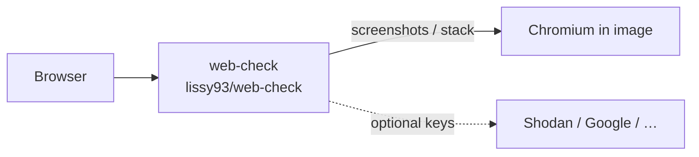

<div align="center">

# Web Check on Render

Deploy **Web Check**, the all-in-one OSINT tool for analysing any website, on Render with Lissy93's official Docker image (Node + Chromium included).

<p>
  <a href="https://render.com/deploy-template/api/github/start?template_repo=web-check-render-template">
    
  </a>
</p>

<p>
  <a href="https://render.com">
    
  </a>
  <a href="https://github.com/Lissy93/web-check">
    
  </a>
  <a href="https://hub.docker.com/r/lissy93/web-check">
    
  </a>
  <a href="https://web-check-n02a.onrender.com/check">
    
  </a>
</p>

</div>


## What This Template Shows

This repo packages the official `lissy93/web-check` image as a one-click Render Blueprint:

| Piece | Role |
| --- | --- |
| **[Web Check](https://github.com/Lissy93/web-check)** | OSINT suite: DNS, SSL, headers, screenshots, tech stack, threats, and more |
| **[lissy93/web-check](https://hub.docker.com/r/lissy93/web-check)** | Official image with Node 22, Chromium, and traceroute |
| **[Render Web Service](https://render.com/docs/web-services)** | Runs the image on a Standard instance |

No source build on Render. Optional enrichment API keys (Shodan, Google, etc.) can be added after deploy; many checks work without them.

## Architecture



### How It Works

1. Click **Deploy to Render**. Render forks this template into your GitHub account and applies [`render.yaml`](./render.yaml).
2. Render pulls `lissy93/web-check:2.1.10` and starts it on port `3000` behind TLS.
3. Open the `*.onrender.com` URL and enter a domain or URL to analyse.
4. Optionally add enrichment API keys in the Dashboard for Shodan, Safe Browsing, Tranco, and similar jobs.

| Resource | Type | Plan | Notes |
| --- | --- | --- | --- |
| `web-check` | Web (`runtime: image`) | **standard** | Official image; health check `/`; Chromium + traceroute bundled |

Default region: **oregon**. No database or disk: scan results are returned to the browser; the filesystem is ephemeral.

## Quick Start

### Prerequisites

- A [Render account](https://dashboard.render.com/register?utm_source=github&utm_medium=referral&utm_campaign=ojus_demos&utm_content=readme_link)

### Deploy

1. Click **Deploy to Render** above and fork into your GitHub account.
2. On Apply, confirm the `web-check` service. Leave optional API key fields blank.
3. Wait until the service is **Live** (~3–8 minutes; first image pull can take longer).
4. Open the public URL and run a check against a site you own or have permission to scan.

Smoke test:

```bash
curl -sS -o /dev/null -w "%{http_code}\n" https://<your-service>.onrender.com/
```

## Features

| Feature | Description |
| --- | --- |
| **Official image** | Uses maintained `lissy93/web-check` tags from Docker Hub |
| **Chromium ready** | Screenshots / tech-stack jobs use system Chromium in the image |
| **One-click Blueprint** | Single Standard web service; no build step |
| **Works without keys** | Core DNS/SSL/header jobs run zero-config |
| **Optional enrichment** | Shodan, Google, WhoAPI, and others via env after deploy |
| **Pinned by default** | Image set to `2.1.10`; bump deliberately |

## Configuration

| Variable | Source | Description |
| --- | --- | --- |
| `PORT` | Wired | `3000` (image default) |
| `TRUST_PROXY` | Wired | `1` so Express trusts Render's proxy |
| `CHROME_PATH` / `PUPPETEER_*` | Wired | Point at `/usr/bin/chromium` in the image |
| `API_ENABLE_RATE_LIMIT` | Wired | `true` to protect public instances |
| `GOOGLE_CLOUD_API_KEY` | Optional | Quality / Safe Browsing style jobs |
| `SHODAN_API_KEY` | Optional | Host / hostname enrichment |
| `WHO_API_KEY` | Optional | Richer Whois |
| `SECURITY_TRAILS_API_KEY` | Optional | Org / IP enrichment |
| `URL_SCAN_API_KEY` | Optional | urlscan.io data |
| `CLOUDMERSIVE_API_KEY` | Optional | Threat intel |
| `BUILT_WITH_API_KEY` | Optional | Tech / feature detection |
| `TRANCO_API_KEY` / `TRANCO_USERNAME` | Optional | Traffic rank |
| `TORRENT_IP_API_KEY` | Optional | IP torrent history |

See [`.env.example`](./.env.example) and upstream [`.env.sample`](https://github.com/Lissy93/web-check/blob/master/.env.sample).

### Pin or float the image

```yaml
# render.yaml
image:
  url: docker.io/lissy93/web-check:2.1.10
  # floating:
  # url: docker.io/lissy93/web-check:latest
```

`autoDeployTrigger: off` so tag edits do not redeploy until you choose **Manual Deploy**.

## Cost

| Resource | Approx. monthly |
| --- | ---: |
| Web service (Standard) | ~$25 |
| **Total** | **~$25** |

**Standard is the floor.** The image runs Node plus Chromium. Starter (512 MB) often OOMs during screenshot / tech-stack jobs, which shows up as failed checks or "No open ports detected" if the process dies at boot.

## Troubleshooting

| Problem | Solution |
| --- | --- |
| Health check fails / no open ports | Keep **Standard**. Confirm `PORT=3000`. |
| Screenshots or tech-stack empty | Chromium paths are set in the Blueprint; check logs for Chrome crashes and bump plan if OOM. |
| Enrichment job says missing key | Add the matching API key in Dashboard → Environment (see table above). |
| Image pull failures | Confirm `lissy93/web-check:2.1.10` on [Docker Hub](https://hub.docker.com/r/lissy93/web-check/tags). Retry deploy. |
| Rate limited | Expected when `API_ENABLE_RATE_LIMIT=true`. Raise limits or disable for private instances. |

## Project Structure

```
render.yaml       Render Blueprint (image)
README.md         This file
LICENSE           MIT (template wrapper)
.env.example      Optional enrichment keys
assets/           Hero / logo
```

## Learn More

**Render:**
- [Web Services](https://render.com/docs/web-services)
- [Deploy an image](https://render.com/docs/docker#deploy-an-image)
- [Blueprints](https://render.com/docs/infrastructure-as-code)
- [Deploy to Render button](https://render.com/docs/deploy-to-render-button)

**Web Check:**
- [Upstream repo](https://github.com/Lissy93/web-check)
- [Docker Hub](https://hub.docker.com/r/lissy93/web-check)
- [Live demo on Render](https://web-check-n02a.onrender.com/check)
- [Env sample](https://github.com/Lissy93/web-check/blob/master/.env.sample)

## License

[MIT](LICENSE) for this template wrapper.

Upstream [Web Check](https://github.com/Lissy93/web-check) is MIT. Star that repo if this helped.
